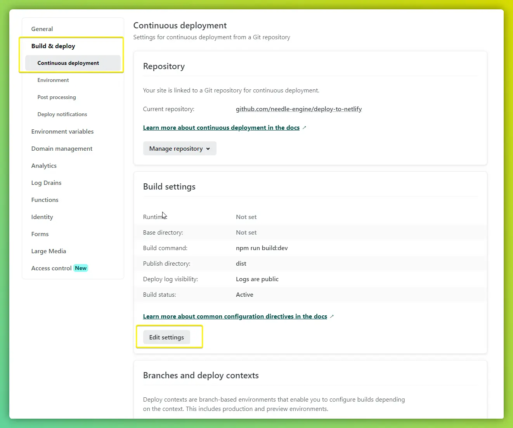

# Needle Engine on Netlify
This repository contains a vite based web project generated in Unity ([Live Link](https://needle-engine-netlify-sample.netlify.app/)).  
For use Netlify's continuous deployment pipeline the following changes need to be made:
- Make sure gzip is disabled in `vite.config.js`.   
  → Remove this line `useGzip(needleConfig) ? viteCompression({ deleteOriginFile: true }) : null` in `vite.config.js` in your project

## Setup on Netlify

0) [Create a new project on netlify](https://app.netlify.com/start/repos?entryPoint=from%20TeamOverview) using a git provider like Github
1) Go to "Site settings/Build & deploy" and click on "Continous deployment"
2) In "Build Settings" enter:
    - Build command: `npm run build:dev`
    - Publish directory: `dist`

## Troubleshooting
### Deployment fails
- Try deleting your package.lock.json in your project (and optionally add it to your `.gitignore` file)

## Internal
- [Netlify project url](https://app.netlify.com/sites/needle-engine-netlify-sample)
